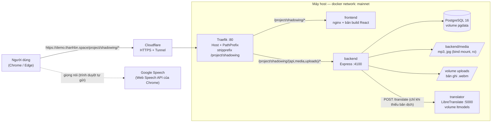
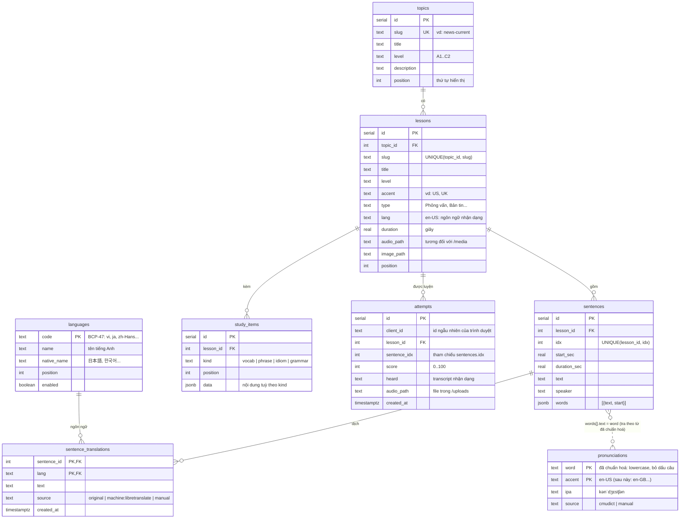
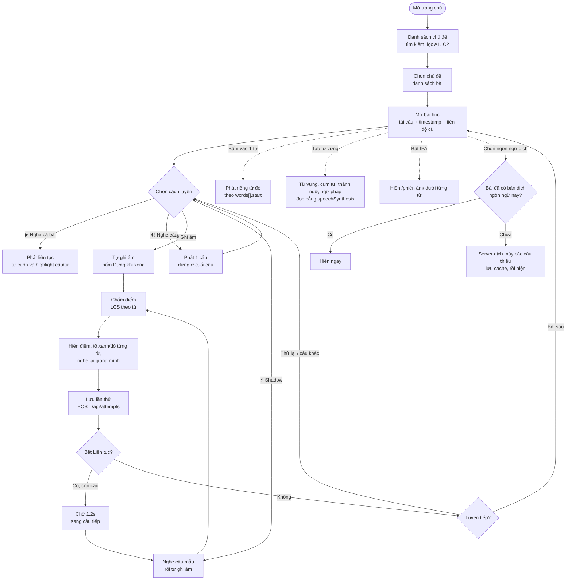
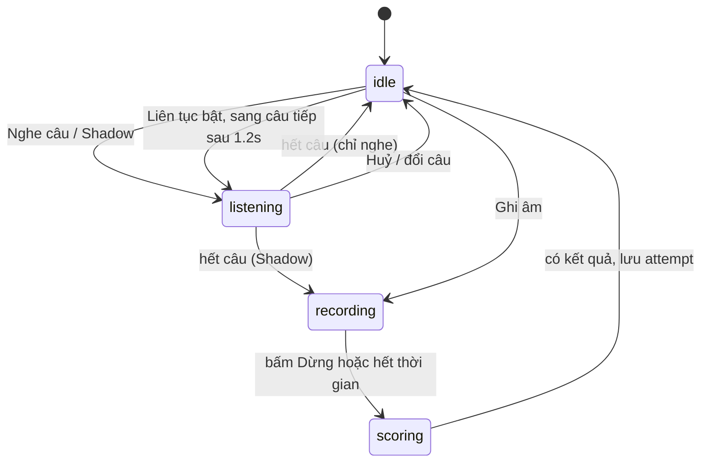
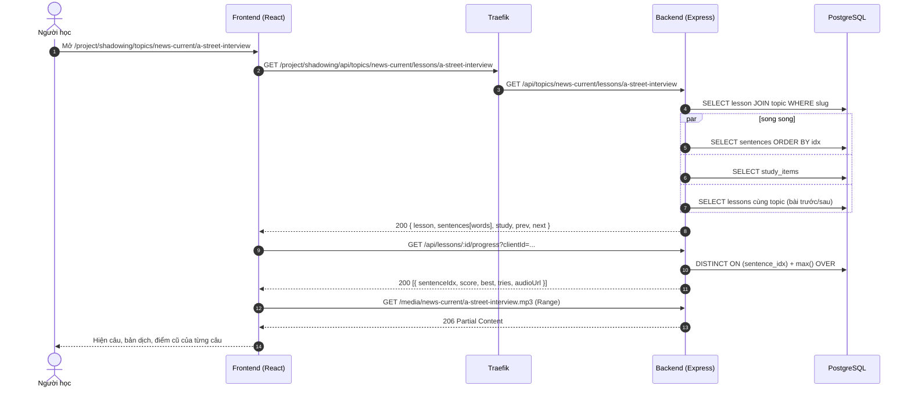
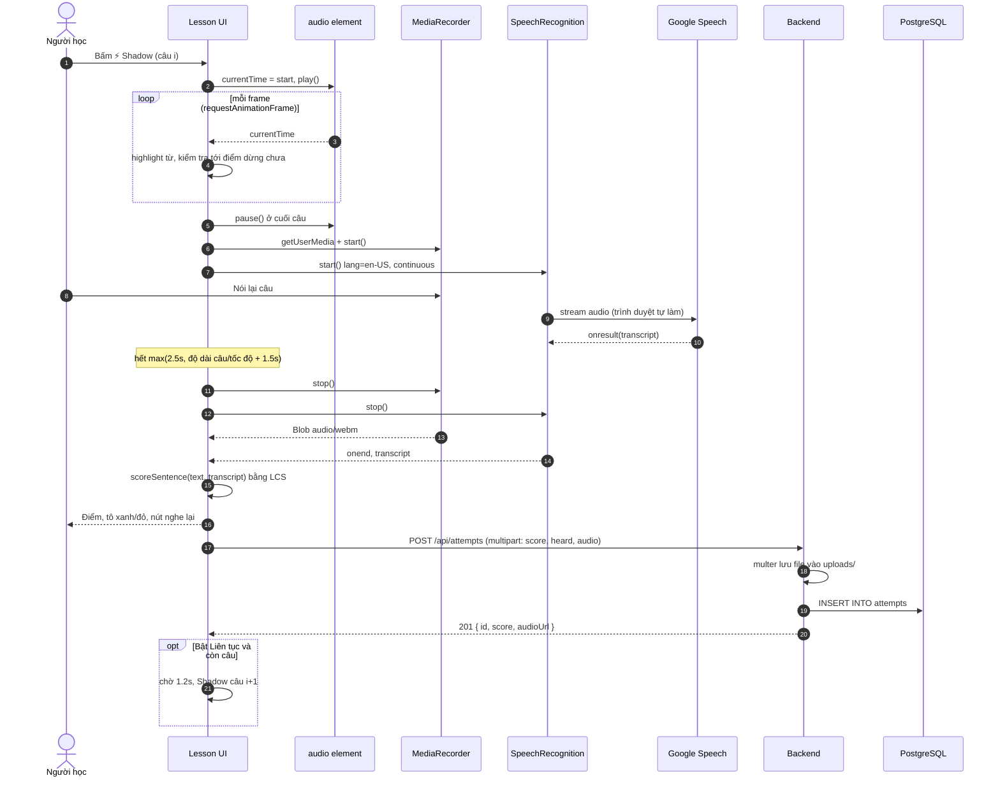
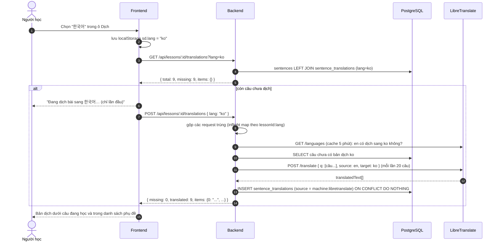
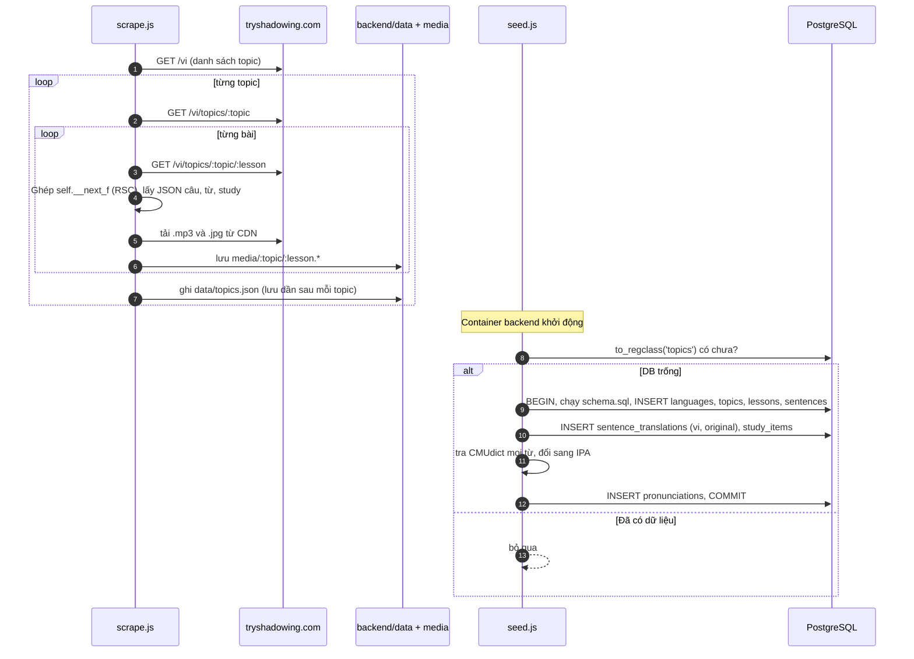

# Shadowing demo

Bản demo tính năng shadowing theo kiểu tryshadowing.com: nghe từng câu (có highlight từng từ), nhại lại, được chấm điểm theo từ. Mỗi từ có phiên âm IPA, mỗi câu có bản dịch sang 11 ngôn ngữ (dịch máy khi cần, lưu cache trong DB).

| Thành phần | Công nghệ |
|---|---|
| Frontend | React 19 + Vite + react-router, build tĩnh, phục vụ bằng nginx |
| Backend | Node 24, Express 5, `pg`, `multer` |
| Database | PostgreSQL 16 |
| Gateway | Traefik v3 (Docker provider), đứng sau Cloudflare Tunnel |
| Phiên âm | CMU Pronouncing Dictionary (`cmu-pronouncing-dictionary`), chuyển ARPAbet sang IPA, giọng US |
| Dịch máy | LibreTranslate tự host (Argos models). Provider dạng plugin, có thể thay bằng DeepL, Google hoặc Claude |
| Trên trình duyệt | HTML5 `<audio>`, `MediaRecorder`, Web Speech API (`SpeechRecognition`, `speechSynthesis`) |

**Mục lục**
1. [Chạy](#1-chạy)
2. [Kiến trúc tổng thể](#2-kiến-trúc-tổng-thể)
3. [Cơ sở dữ liệu](#3-cơ-sở-dữ-liệu)
4. [Luồng nghiệp vụ](#4-luồng-nghiệp-vụ)
5. [Sequence diagram](#5-sequence-diagram)
6. [API](#6-api)
7. [Cấu trúc mã nguồn](#7-cấu-trúc-mã-nguồn)
8. [Mở rộng: thêm ngôn ngữ, đổi provider dịch](#8-mở-rộng-thêm-ngôn-ngữ-đổi-provider-dịch)
9. [Lưu ý về dữ liệu](#9-lưu-ý-về-dữ-liệu)

---

## 1. Chạy

### Docker + Traefik (khuyến nghị)

```bash
docker compose up -d --build
```

| URL | |
|---|---|
| https://demo.thanhbn.space/project/shadowing | Public (Cloudflare Tunnel → localhost:80 → Traefik) |
| http://shadowing.localhost/project/shadowing | Local |
| http://traefik.shadowing.localhost | Traefik dashboard (chỉ local) |

- Domain và sub-path cấu hình trong `.env`: `APP_HOST`, `BASE_PATH`. Đổi xong chạy lại `docker compose up -d --build` vì frontend phải build lại với base mới.
- Lần đầu khởi động, backend tự seed DB từ `backend/data/topics.json` nếu DB còn trống.
- `backend/media` và `backend/data` được mount từ máy host (read-only). File ghi âm lưu trong volume `uploads`, dữ liệu DB trong volume `pgdata`. Mọi container dùng chung network `mainnet`.
- Seed lại từ đầu: `docker compose exec backend node scripts/seed.js`. Nếu đã có lịch sử luyện tập thì seed từ chối chạy, cần thêm `--force` (sẽ xoá hết attempts). Xoá sạch: `docker compose down -v`.
- Lần đầu chạy, `translator` (LibreTranslate) tải khoảng **2,8 GB** model vào volume `ltmodels`, mất vài chục phút. Trong lúc đó app vẫn chạy bình thường, chỉ chưa dịch được sang ngôn ngữ mới (tiếng Việt có sẵn). Danh sách ngôn ngữ tải model: `TRANSLATE_LANGS` trong `.env`.
- Dịch sẵn cả loạt để mở bài là có ngay: `docker compose exec backend node scripts/translate.js ja ko zh-Hans [--topic news-current]`.
- Micro chỉ chạy trên HTTPS hoặc `*.localhost`. Nên dùng **Chrome/Edge** để chấm điểm. Firefox, Safari và Brave vẫn ghi âm và nghe lại được nhưng không có điểm.

### Dev (không Docker)

```bash
docker compose up -d db                                          # Postgres :5434
cd backend  && npm install && npm run db:init && npm run dev     # API :4100
cd frontend && npm install && npm run dev                        # Web :5180
```

Lấy thêm dữ liệu: `cd backend && npm run scrape -- --all` (tất cả topic) hoặc `npm run scrape -- hotel restaurant`.

---

## 2. Kiến trúc tổng thể



**Bảng định tuyến của Traefik** (sau khi strip `BASE_PATH`):

| Request từ trình duyệt | Router | Container nhận |
|---|---|---|
| `/project/shadowing/api/...` | `shadowing-api` | `backend:4100/api/...` |
| `/project/shadowing/media/...` | `shadowing-api` | `backend:4100/media/...` (static, hỗ trợ `Range`) |
| `/project/shadowing/uploads/...` | `shadowing-api` | `backend:4100/uploads/...` |
| `/project/shadowing/...` (còn lại) | `shadowing-web` | `frontend:80/...` (SPA fallback về `index.html`) |

**Chạy ở đâu:**
- **Trên trình duyệt:** phát audio, highlight karaoke, ghi âm, nhận dạng giọng nói, chấm điểm.
- **Trên server:** lưu và trả nội dung bài học, gắn IPA vào từng từ, dịch máy và cache bản dịch, lưu lịch sử luyện tập và file ghi âm. Server không xử lý audio.
- `translator` chỉ nằm trong network nội bộ `mainnet`, không public qua Traefik.

---

## 3. Cơ sở dữ liệu

Schema: [`backend/db/schema.sql`](backend/db/schema.sql)



**Ghi chú thiết kế**
- **Một file mp3 cho cả bài.** Mỗi câu chỉ lưu `start_sec` và `duration_sec`, trình duyệt tự tua tới đúng đoạn. Không cắt file theo câu.
- **`sentences.words`** là mảng JSONB `[{ "text": "Excuse", "start": 0.05 }, …]`, dùng để highlight từng từ và bấm vào một từ để nghe riêng. Chỉ đọc theo cả câu nên không tách bảng riêng.
- **Bản dịch nằm ở bảng riêng `sentence_translations (sentence_id, lang)`**, không phải cột trên `sentences`. Thêm ngôn ngữ không cần đổi schema.
  - `source` cho biết bản dịch từ đâu. Hiện có `original` (tiếng Việt có sẵn từ nguồn: 2.096/3.606 câu) và `machine:libretranslate`. 154 bài trên trang gốc không có sẵn tiếng Việt, 1.510 câu của các bài đó đã được dịch máy sẵn.
  - Sau này có thể nhờ người sửa (`manual`), hoặc xoá bản dịch máy cũ để dịch lại bằng provider tốt hơn.
- **`pronunciations` là từ điển dùng chung cho mọi bài**, khoá chính `(word, accent)`. Hiện có 4.909/5.079 từ có IPA. Các từ còn thiếu là số, mã như `b12`, `a12` và tên riêng.
  - API gắn `ipa` vào `words[]` lúc trả về, nên sửa phiên âm một từ thì mọi bài đều cập nhật theo.
  - Có cột `accent` để thêm giọng UK mà không đụng dữ liệu cũ.
- **`study_items.data`** có cấu trúc khác nhau theo `kind`:

  | kind | Các field trong `data` |
  |---|---|
  | `vocab` | `term, pos, vi, en, example` |
  | `phrase` | `expr, vi, en, example` |
  | `idiom` | `idiom, vi, en, example` |
  | `grammar` | `point, vi, en, example` |

- **`attempts`** ghi lại mọi lần thử, không ghi đè. "Lần gần nhất" và "điểm cao nhất" được tính lúc đọc bằng window function. Index: `(client_id, lesson_id, sentence_idx)`.
- **Chưa có bảng `users`.** Demo định danh trình duyệt bằng `client_id`, một UUID lưu trong `localStorage`. Khi có đăng nhập thì thêm `user_id` vào `attempts`.

---

## 4. Luồng nghiệp vụ

### 4.1 Hành trình người học



### 4.2 Các trạng thái của màn bài học

Code: [`frontend/src/lib/useShadowing.js`](frontend/src/lib/useShadowing.js)



### 4.3 Các quy tắc

| Quy tắc | Giá trị |
|---|---|
| Điểm dừng khi phát 1 câu | `min(start + duration + 0.25s, start của câu sau)` |
| Từ đang được highlight | Từ cuối cùng có `words[i].start - 0.05 ≤ currentTime` |
| Thời gian tự ghi âm (Shadow) | `max(2.5s, (độ dài câu / tốc độ) + 1.5s)` |
| Chuẩn hoá trước khi so | lowercase, bỏ dấu câu, tách theo khoảng trắng và gạch nối, đổi số 0–10 thành chữ |
| Điểm | `số token khớp theo LCS / tổng token câu mẫu × 100` |
| Từ bị tô đỏ | Từ có ít nhất một token không khớp |
| Màu điểm | ≥ 85 xanh · 60–84 vàng · < 60 đỏ |
| Phiên âm | IPA giọng US theo CMUdict. Từ nhiều âm tiết có dấu trọng âm `ˈ` (chính) và `ˌ` (phụ). Từ ghép `low-income` thì ghép IPA từng phần |
| Ngôn ngữ dịch mặc định | `vi`. Lựa chọn ngôn ngữ dịch và bật/tắt IPA lưu trong `localStorage` (`sd.lang`, `sd.ipa`) |
| Dịch máy khi nào | Chỉ dịch các câu **chưa có** bản dịch ngôn ngữ đó. Dịch một lần cho cả bài, lưu cache vĩnh viễn. Hai người mở cùng lúc thì server chỉ gọi provider một lần |
| Khi nào lưu attempt | Chỉ khi nhận dạng giọng nói chạy được. Trình duyệt không hỗ trợ thì vẫn nghe lại được nhưng không lưu điểm |

---

## 5. Sequence diagram

### 5.1 Mở bài học



### 5.2 Shadow một câu



### 5.3 Đổi ngôn ngữ dịch



Không có provider hoặc provider chưa sẵn sàng thì server trả `503 translator_unavailable`, frontend báo "Chưa dịch được sang …". Bài vẫn học bình thường.

### 5.4 Nạp dữ liệu



---

## 6. API

Base URL:
- Public: `https://demo.thanhbn.space/project/shadowing`
- Dev: `http://localhost:4100`

Mọi response là JSON. Các URL `audioUrl`, `image`, `cover` trả về đã có sẵn `PUBLIC_URL` (vd `/project/shadowing/media/...`), dùng trực tiếp được.

| Method | Path | Mô tả |
|---|---|---|
| GET | `/api/health` | Kiểm tra sống |
| GET | `/api/topics` | Danh sách chủ đề |
| GET | `/api/topics/:slug` | Chủ đề và danh sách bài |
| GET | `/api/languages` | Ngôn ngữ dịch đang bật |
| GET | `/api/topics/:topic/lessons/:lesson[?lang=]` | Chi tiết bài học: `words[].ipa`, kèm bản dịch nếu có `lang` |
| GET | `/api/lessons/:id/translations?lang=` | Bản dịch đã có (chỉ đọc) |
| POST | `/api/lessons/:id/translations` | Dịch máy các câu còn thiếu rồi trả về toàn bộ |
| POST | `/api/attempts` | Lưu một lần shadow |
| GET | `/api/lessons/:id/progress?clientId=` | Tiến độ theo câu |
| GET | `/media/*` | mp3 và jpg của bài (static, hỗ trợ `Range`, cache 7 ngày) |
| GET | `/uploads/*` | File ghi âm của người học |

### `GET /api/health`
```json
{ "ok": true }
```

### `GET /api/languages`
`original`: có bản dịch gốc từ nguồn. `autoTranslate`: provider dịch máy đang hỗ trợ ngôn ngữ này.
```json
[
  { "code": "vi", "name": "Vietnamese", "nativeName": "Tiếng Việt", "original": true,  "autoTranslate": true },
  { "code": "ja", "name": "Japanese",   "nativeName": "日本語",      "original": false, "autoTranslate": true }
]
```

### `GET /api/topics`
```json
[
  {
    "slug": "news-current",
    "title": "News & Current Topics",
    "level": "B2",
    "description": "Chủ đề này giúp bạn luyện…",
    "lesson_count": 8,
    "cover": "/project/shadowing/media/news-current/morning-news.jpg"
  }
]
```

### `GET /api/topics/:slug`
`404 { "error": "not_found" }` nếu không có slug.
```json
{
  "slug": "news-current",
  "title": "News & Current Topics",
  "level": "B2",
  "description": "…",
  "lessons": [
    {
      "slug": "morning-news",
      "title": "Morning news update",
      "level": "B1",
      "accent": "🇺🇸 US",
      "type": "Bản tin",
      "duration": 47.488,
      "sentence_count": 10,
      "image": "/project/shadowing/media/news-current/morning-news.jpg"
    }
  ]
}
```

### `GET /api/topics/:topic/lessons/:lesson[?lang=vi]`
`404 { "error": "not_found" }` nếu không có bài.
- Mỗi từ trong `words[]` có `ipa` (`null` nếu từ điển không có từ đó).
- Có `?lang=` thì mỗi câu có thêm `translation`. Bằng `null` nếu chưa dịch, khi đó gọi `POST /api/lessons/:id/translations` để dịch.
```json
{
  "id": 2,
  "slug": "a-street-interview",
  "title": "A street interview",
  "level": "B2",
  "accent": "🇺🇸 US",
  "type": "Phỏng vấn",
  "lang": "en-US",
  "duration": 67.612,
  "audioUrl": "/project/shadowing/media/news-current/a-street-interview.mp3",
  "image": "/project/shadowing/media/news-current/a-street-interview.jpg",
  "topic": { "slug": "news-current", "title": "News & Current Topics" },
  "prev": { "slug": "morning-news", "title": "Morning news update" },
  "next": { "slug": "discussing-the-headlines", "title": "Discussing the headlines" },
  "sentences": [
    {
      "idx": 0,
      "start": 0.05,
      "duration": 4.45,
      "text": "Excuse me, do you have a minute to share your thoughts about the new congestion charge proposal?",
      "speaker": "Interviewer",
      "translation": "Xin lỗi, bạn có một phút để chia sẻ suy nghĩ về đề xuất phí ùn tắc giao thông mới không?",
      "words": [
        { "text": "Excuse", "start": 0.05, "ipa": "ɪkˈskjus" },
        { "text": "me,", "start": 0.563, "ipa": "mi" }
      ]
    }
  ],
  "study": {
    "vocab":   [ { "term": "congestion charge", "pos": "noun", "vi": "phí ùn tắc giao thông", "en": "a fee drivers pay…", "example": "the new congestion charge proposal" } ],
    "phrase":  [ { "expr": "Do you have a minute", "vi": "bạn có chút thời gian không", "en": "…", "example": "…" } ],
    "idiom":   [ { "idiom": "spare a moment", "vi": "dành chút thời gian", "en": "…", "example": "…" } ],
    "grammar": [ { "point": "First conditional for real future conditions", "vi": "…", "en": "…", "example": "…" } ]
  }
}
```

### `GET /api/lessons/:id/translations?lang=ja`
Chỉ đọc cache, không gọi dịch máy.
```json
{ "lang": "ja", "total": 12, "missing": 0, "items": { "0": "すみません、…", "1": "確かに、…" } }
```

### `POST /api/lessons/:id/translations`
Body `{ "lang": "ko" }` (hoặc `?lang=ko`). Dịch các câu còn thiếu, lưu DB, trả về giống API GET ở trên kèm `translated` là số câu vừa dịch. Gọi lại khi đã đủ thì `translated: 0` và không gọi provider.
```bash
curl -X POST -H 'Content-Type: application/json' -d '{"lang":"ko"}' \
     https://demo.thanhbn.space/project/shadowing/api/lessons/2/translations
```
```json
{ "lang": "ko", "total": 12, "missing": 0, "translated": 12, "items": { "0": "실례합니다, …" } }
```

### `POST /api/attempts`
`Content-Type: multipart/form-data`

| Field | Bắt buộc | Kiểu | Ghi chú |
|---|---|---|---|
| `clientId` | ✓ | string | UUID của trình duyệt |
| `lessonId` | ✓ | int | `id` lấy từ API chi tiết bài |
| `sentenceIdx` | ✓ | int | `sentences[].idx` |
| `score` | ✓ | int | 0–100, server tự giới hạn trong khoảng này |
| `heard` | | string | transcript |
| `audio` | | file | `audio/webm`, `audio/mp4` hoặc `audio/ogg`, tối đa 10 MB |

```bash
curl -F clientId=abc -F lessonId=2 -F sentenceIdx=0 -F score=88 -F heard="excuse me do you have a minute" \
     -F "audio=@rec.webm;type=audio/webm" \
     https://demo.thanhbn.space/project/shadowing/api/attempts
```
`201`
```json
{
  "id": 12,
  "score": 88,
  "heard": "excuse me do you have a minute",
  "sentenceIdx": 0,
  "createdAt": "2026-10-01T10:47:07.272Z",
  "audioUrl": "/project/shadowing/uploads/1790851627251-40aab410-….webm"
}
```
Thiếu field bắt buộc thì trả `400 { "error": "missing_fields" }`.

### `GET /api/lessons/:id/progress?clientId=`
Mỗi câu một dòng: lần thử gần nhất, kèm `best` (điểm cao nhất) và `tries` (số lần thử). Thiếu `clientId` thì trả `400 { "error": "missing_client" }`.
```json
[
  {
    "sentenceIdx": 0,
    "score": 88,
    "best": 92,
    "tries": 3,
    "heard": "excuse me do you have a minute",
    "createdAt": "2026-10-01T10:47:07.272Z",
    "audioUrl": "/project/shadowing/uploads/….webm"
  }
]
```

### Mã lỗi

| HTTP | `error` | Khi nào |
|---|---|---|
| 400 | `missing_fields` | POST attempts thiếu field |
| 400 | `missing_client` | progress thiếu `clientId` |
| 400 | `missing_lang` | translations thiếu `lang` |
| 400 | `unsupported_language` | `lang` không có trong bảng `languages` hoặc đang tắt |
| 503 | `translator_unavailable` | Provider dịch chưa chạy, đang tải model, hoặc không hỗ trợ ngôn ngữ đó |
| 404 | `not_found` | Topic hoặc bài không tồn tại |
| 500 | `internal` | Lỗi DB, file quá 10 MB… (kèm `message`) |

---

## 7. Cấu trúc mã nguồn

```
.
├── docker-compose.yml        traefik, db, backend, translator, frontend (network mainnet)
├── .env                      APP_HOST, BASE_PATH, TRANSLATE_LANGS
├── backend/
│   ├── Dockerfile            node:24-alpine; CMD: seed --if-empty && server
│   ├── db/schema.sql         schema (mục 3)
│   ├── scripts/scrape.js     clone dữ liệu từ tryshadowing.com (mục 5.3)
│   ├── scripts/seed.js       nạp data/topics.json + IPA vào DB (--if-empty, --force)
│   ├── scripts/translate.js  dịch sẵn hàng loạt theo ngôn ngữ/topic
│   ├── src/db.js             pg Pool
│   ├── src/ipa.js            CMUdict -> IPA, chuẩn hoá từ
│   ├── src/languages.js      danh sách ngôn ngữ dịch (seed vào bảng languages)
│   ├── src/translations.js   đọc cache / dịch các câu thiếu
│   ├── src/translate/        provider dịch máy: index.js (chọn theo env), libretranslate.js
│   └── src/server.js         REST API + static /media, /uploads
└── frontend/
    ├── Dockerfile            build Vite theo BASE_PATH, rồi nginx
    ├── nginx.conf            SPA fallback, cache /assets
    └── src/
        ├── lib/api.js         gọi API, clientId, tuỳ chọn người xem (localStorage)
        ├── lib/useTranslations.js tải/dịch bản dịch theo ngôn ngữ đã chọn
        ├── lib/useShadowing.js state machine phát/ghi/chấm (mục 4.2)
        ├── lib/recorder.js    MediaRecorder + SpeechRecognition chạy song song
        ├── lib/scoring.js     chấm điểm LCS
        ├── pages/Home.jsx, Topic.jsx, Lesson.jsx
        └── components/StudyPanel.jsx
```

Phím tắt trong bài học: `Space` nghe câu (hoặc dừng ghi), `R` ghi âm, `S` shadow, `←/→` đổi câu.

---

## 8. Mở rộng: thêm ngôn ngữ, đổi provider dịch

### Thêm một ngôn ngữ dịch (vd tiếng Ý)
1. Thêm `{ code: 'it', name: 'Italian', nativeName: 'Italiano' }` vào `backend/src/languages.js`, hoặc chèn thẳng vào DB đang chạy:
   ```sql
   INSERT INTO languages (code, name, native_name, position) VALUES ('it', 'Italian', 'Italiano', 20);
   ```
2. Thêm mã vào `TRANSLATE_LANGS` trong `.env` rồi chạy `docker compose up -d translator` để tải model.
3. (Tuỳ chọn) dịch sẵn: `docker compose exec backend node scripts/translate.js it`.

Frontend tự hiện ngôn ngữ mới trong ô **Dịch** vì danh sách lấy từ `GET /api/languages`.

### Đổi hoặc thêm provider dịch máy
Mỗi provider là một module có cùng interface (xem `backend/src/translate/index.js`):
```js
export default {
  name: 'deepl',
  async supports(lang, source) { /* true nếu dịch được source -> lang */ },
  async translate(texts, { source, target }) { /* trả string[] cùng thứ tự */ },
};
```
Đăng ký module vào `PROVIDERS`, rồi đặt `TRANSLATE_PROVIDER=deepl` (kèm API key) cho service `backend`. Bản dịch mới được lưu với `source = 'machine:deepl'`.

Muốn dịch lại những câu đã dịch bằng provider cũ thì xoá chúng rồi chạy script:
```sql
DELETE FROM sentence_translations WHERE source = 'machine:libretranslate' AND lang = 'ja';
```
```bash
docker compose exec backend node scripts/translate.js ja
```

**Chất lượng dịch hiện tại.** Với các câu hội thoại, LibreTranslate dịch tiếng châu Âu (fr, es, de, pt, ru) khá ổn. Tiếng Nhật và tiếng Hàn thường dịch sát nghĩa từng từ và có chỗ sai, ví dụ tiếng Hàn dịch "pros and cons" thành "직업과 단점" ("nghề nghiệp và nhược điểm"). Muốn demo cho khách thì nên dùng DeepL, Google Cloud Translation hoặc một LLM, hoặc nhờ người sửa tay (`source = 'manual'`).

### Phiên âm
- **Thêm giọng UK:** nạp dữ liệu vào `pronunciations` với `accent = 'en-GB'` (vd từ Wiktionary hoặc một từ điển phát âm UK), rồi chọn accent theo `lessons.accent`.
- **Sửa phiên âm một từ:** `INSERT … ON CONFLICT (word, accent) DO UPDATE SET ipa = …, source = 'manual'`. Mọi bài có từ đó đều đổi theo.

### Dịch phần từ vựng
`study_items.data` hiện chỉ có nghĩa tiếng Việt (`vi`). Muốn đa ngôn ngữ thì tách thành bảng `study_item_translations (study_item_id, lang, meaning)`, làm giống `sentence_translations`.

---

## 9. Lưu ý về dữ liệu

`backend/data` và `backend/media` được clone từ tryshadowing.com, **chỉ dùng để demo nội bộ**. Không commit, không dùng cho sản phẩm. Khi làm sản phẩm thật cần thay bằng nội dung của mình: kịch bản, TTS có timestamp từng từ (hoặc forced alignment như WhisperX), bản dịch.
